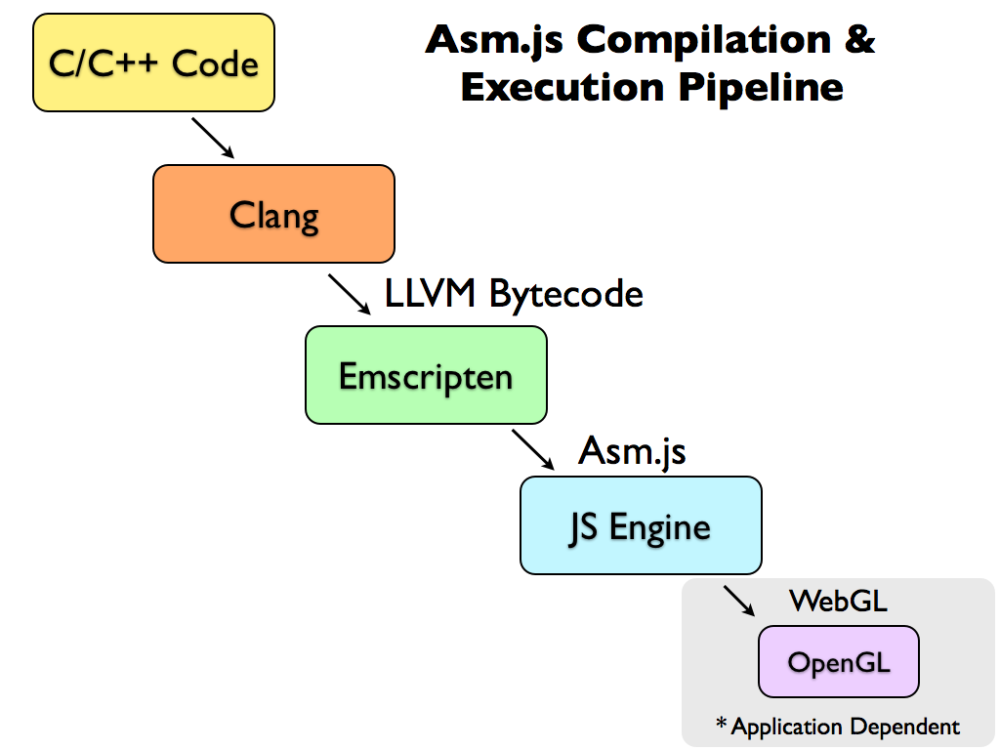

> Ring is a secure and distributed voice, video and chat communication platform that requires no centralized server and leaves the power of privacy in the hands of the user.

On the technical level the Ring project has many components: 

Source: [Technical aspects of Ring](https://ring.cx/en/about/technical).

It may be important to understand that the D-Bus is an IPC (Inter-process communication) mechanism that allows communication between multiple processes concurrently running on the same machine. Nevertheless, it is only present on GNU / Linux, which means that on the other platforms the rest of Ring layers has to be statistically compiled together to create an executable.

# Research

I will summarize the research by using chronological stages. This text is bound to the GitHub repository called [Ring-for-the-web](https://github.com/sevaivanov/ring-for-the-web) which contains all of the examples and proof of concepts that we wrote. The more technical aspects will be placed in the READMEs in each corresponding directory referenced later.

It is important to mention that we were getting familiar with the [Ring-daemon](https://gerrit-ring.savoirfairelinux.com/#/q/status:open) during the research process. To understand how it worked, we had to compile and debug the Ring-gnome client and its LRC library in parallel. Fighting with a large build done by Autotools (GNU Build System) is certainly not straightforward. Moreover, the Ring-daemon wasn't generating a shared library until the end of *Stage 3*, which implies that we also had to create compiling scripts by examining building scripts.

## Stage 1 : Browser plug-in

### WebExtension

We started with the mission to create a browser plug-in to enable a direct communication with the daemon. We explored Firefox and Chrome. Shortly after, we realized that the support for Firefox and Chrome seemed to differ. Firefox is more oriented for the web only plug-in approach called *WebExtension* that was born to unify browser plug-ins. Firefox's goal is to optimize JavaScript to perform as well as the low level (C++). *WebExtension* are supported by Chrome and Opera. Nevertheless, it didn't suit us because we needed to communicate with the Ring-daemon that was written in C++, which implies that bindings between JavaScript and C++ had to be performed. The orientation of a browser plug-in was chosen for good reasons. It would allow a simpler one-step installation for the user without any extra steps.

### Extension

Writing a native extension allows binding directly to the C++ backend.

#### Firefox

Firefox offered a native *Extension* using XPCOM but unfortunately:

> In August 2015, Mozilla announced that the use of [XUL](https://developer.mozilla.org/en-US/docs/Archive/Mozilla/XULRunner) for creating Firefox add-ons would be deprecated in the future in favour of WebExtensions.

We tried building an extension. However, it didn't work due to multiple issues, without saying that the range of operative systems as well as the browser engines (Gecko is the Firefox's one) support was limited:

> XUL has no formal specification and does not inter-operate with non-Gecko implementations. -- [Wikipedia](https://en.wikipedia.org/wiki/XUL)

Results can be found at: [Add-ons/Extensions/XPCOM/](https://github.com/sevaivanov/ring-for-the-web/tree/master/Add-ons/Extensions/XPCOM/).

#### Chrome

Chrome allows building an Extensions using NaCL but they are focusing more on development of Chrome Apps. We stopped the implementation because it turns out that it is only valuable for Chrome browser. What was done can be found at [Add-ons/Extensions/Chrome-NaCl/](https://github.com/sevaivanov/ring-for-the-web/tree/master/Add-ons/Extensions/Chrome-NaCl/).

We stopped researching into the direction of browser plug-ins because their technologies are depreciated and the solution won't be compatible with major browsers.

### Emscripten

Therefore, we went into a new direction of compiling the Ring-daemon into JavaScript using [Emscripten](https://github.com/kripken/emscripten). It is using Low Level Virtual Machine ([LLVM](https://en.wikipedia.org/wiki/LLVM)) which will generate LLVM bytecode from C/C++ and compile it to JavaScript.

 We were unable to compile all of the Ring-daemon dependencies, especially [GMP Library](https://gmplib.org) due to multiple issues like the [long long type](http://stackoverflow.com/questions/18971732/what-is-the-difference-between-long-long-long-long-int-and-long-long-i) conversions. This solution is rather experimental. Perhaps it will be possible in the near future, but then again it may be difficult to debug the generated code because of the complexity of the Ring-daemon implementation.

## Stage 2 : Shared library

We decided to orient our research into creating a RESTful API closely bound to the Ring-daemon to allow simple web communications. In other words, our mission became the replacement of the D-Bus by implementing a layer over LibRing to allow direct interaction with the daemon.

There could be two ways to achieve this. We could have a native C++ server bound to the Ring-daemon or a high-level language controlling it and exposing an interface. We explored both of these directions. I took the high-level part and Simon, the low-level. Therefore, I will try to resume both of our parts to the best of my knowledge.

At first, we went with the idea of generating a shared library that can be dynamically-linked and controlled by the Ring-daemon. This would enable us to delegate control to the daemon and it would also make our server integrable into the project. This presented multiple issues because of the dependencies that would require the shared library to be aware of the Ring-daemon instance to communicate with it in case the client initiates a communication.

Since the latter would demand a plug-in system that is currently under development, we focused on the idea of a wrapper where the control of the daemon is completely delegated to the server.

### High-level

Here is the brief and ordered summary of the different languages that I tried. I even tried *Rust* but due to the lack of time I didn't finish it. To optimize the time by reducing the time spent on building scripts, many of the examples are using Ring-daemon MOQ which is basically C++ code that imitates a native backend.

#### Node.js

> Node.js Addons are dynamically-linked shared objects, written in C or C++, that can be loaded into Node.js using the require() function, and used just as if they were an ordinary Node.js module. They are used primarily to provide an interface between JavaScript running in Node.js and C/C++ libraries.

I liked the idea of performing it in Node.js that is already based on Socket.IO which would support the Callback Ring-daemon system, but the flexibility of such structure is limited and the library is very recent which may cause issues under complex use cases. The strong advantage of Node.js is that it is possible to keep the callbacks in native C++ that would in turn, trigger the JavaScript communication of daemon signals.

The base of the server has been written but the binding to C++ has not been implemented yet.

> At the moment, the method for implementing Addons is rather complicated, involving knowledge of several components and APIs -- [nodejs.org](https://nodejs.org/api/addons.html)

To develop with Node.js it is generally required to use many external modules. Their licenses were mostly compatible with the Ring GPLv3 one. However, the extensive use of external plug-ins is not a good idea. They are generally maintained by one or a few developers that indicates their possible abandon in the near future. The latter pushed me to discover the Go programming language that embeds a lot in it.

Results can be found at: [Server/Nodejs/](https://github.com/sevaivanov/ring-for-the-web/tree/master/Server/Nodejs/).

#### Go

Pros of this option: it is fast to implement, it has a build-in HTTP server, it is easy to maintain, it is scalable and it supports concurrency. Also, Go has a tool called [cgo](https://golang.org/cmd/cgo/) which embeds many things plus a compiler. This option is interesting because C / C++ is called directly from Go by directly importing header files that in turn *cgo* will wrap into the *C* library automatically. Also, it has built-in SWIG support. This leads to the question : what is [SWIG](http://swig.org/)?

> SWIG is a software development tool that connects programs written in C and C++ with a variety of high-level programming languages.

It is has an interlanguage syntax to create bindings between different languages types. Therefore, the main part of the work would focus on the creation of custom mapping between C++ and Go using SWIG. There is an excellent example of how this can be done in [Ring-client-android](https://github.com/savoirfairelinux/ring-client-android/blob/master/ring-android/app/src/main/jni/jni_interface.i). Nevertheless, debugging SWIG is not very straightforward. Also, there is a lack of flexibility to define a custom folder structure that I documented in the repository technical README's file. The reasons cited previously motivated me to search for another solution.

This method was highly developed to support a wrapper and a shared library.

Results can be found at: [Server/Go/](https://github.com/sevaivanov/ring-for-the-web/tree/master/Server/Go/).

### Low-level (C++)

In parallel with the previous *High-level stage* Simon was developing the C++ server. He started using *Boost* library to define a custom RESTful C++ server. This option is directly compatible with C++ Ring-daemon. It was very flexible and promising. The down side is the necessity to implement a large variety of things. The implementation of a complete RESTful server implies building support for JSON, WebSockets, HTTP and everything that the web server would need. Even if it is done, extensive testing would not be done which diminishes the robustness of this solution.

This solution was highly developed and is available under [Server/Cpp/Bootstrap](https://github.com/sevaivanov/ring-for-the-web/tree/master/Server/Cpp/Bootstrap/) folder.

We decided to try a different solution for this matter.

We started searching for libraries. This would ensure robustness and stability. However, it appeared that the available ones were either very recent, still at their developing stage, or written in pure C which would make debugging a long and tedious process. The few others that we found were abandoned. The list of the eligible ones is available at [Server/Cpp/README.md](https://github.com/sevaivanov/ring-for-the-web/tree/master/Server/Cpp/README.md). We decided to try Restbed.

## Stage 3 : Cython vs Restbed

### Restbed

The development of this solution went smoothly. A lot of the Ring-daemon interfaces were rewritten and implemented for the RESTful HTTP server infrastructure. However, we learned that the support for Web Sockets may be released only for the next 4.5 version. This solution source code would be pushed into Ring-daemon Gerrit repository into the *bin/restcpp* folder. I will update the exact link when it will be merged.

### Python

At the same time, I started searching for a Python solution. I was amazed by the variety of possible solutions. Or course, there is again SWIG since it is omnipresent but there are many other options. I documented a few of them in [Server/Python/](https://github.com/sevaivanov/ring-for-the-web/tree/master/Server/Python/). I tried many of the options in Python. However, the method of implementation was unclear. It is not always obvious to dive into a new library, understand it before the testing the integration.

The most amazing part is that Python / C API is built-in in the language. It is a standard interface to interact with C and C++. It was my first implementation directly bound to the Ring-daemon. It can be found at [Server/Python/shared/ring-rest-py/](https://github.com/sevaivanov/ring-for-the-web/tree/master/Server/Python/shared/ring-rest-py/). I created a C++ bridge that embedded external Python scripts which were running a RESTful Bottle server. I manage to communicate with the Python code from the custom C++ bridge file. I was oriented to create a shared library. The Ring-daemon was supposed to initiate and control the web server. On signal events, it would *push* data to the client using the web server. However, the inverse caused an issue.

In this situation, communication is initiated by the client behind the web server which performs a *pull* from the daemon. This would demand the bridge written in C++ to possess an instance of the Ring-daemon. It represented an interdependence issue. Both of the parties can't contain the opposite instance in the same time. However, it would be possible for the C++ bridge of the web server to register itself at the Ring-daemon. The plug-in system that would allow that was still under development.

We decided to get back to the wrapper concept that wouldn't exclude its integration to Ring-daemon's plug-in system in the future.

> The Cython programming language is a superset of Python, designed to give C-like performance with code which is mostly written in Python. It is a compiled language that generates CPython extension modules. These extension modules can then be loaded and used by regular Python code using the import statement.

I had the choice to go back to Go to integrate my wrapper to Ring-daemon or to explore something else. I decided to take a day to search for another Python option. Many people recommended Cython. Its syntax seemed like a whole new language to learn. By coincidence, I found out that the *OpenDHT* library which Ring uses for communications had a [Cython wrapper](https://github.com/savoirfairelinux/opendht/tree/master/python) which is used to expose the C++ library code to Python. Even more, they already implemented callbacks that I had just started to read about in Go. It was quite advanced to define an interlanguage structure that would behave the same way in both of the languages. The *OpenDHT* wrapper ensured me that the implementation with Ring-daemon would work.

Cython is very debugging friendly and it had automatic build scripts using Python tools. After a single week, the communication initiated from the Cython was implemented and different account data was extracted. The RESTful HTTP server could receive an instance and return it in JSON acting as an RESTful API. Even more, it was possible to interact with the Cython wrapper directly in the IPython interpreter.

----

The solution for the Python + Cython wrapper was heading into a promising direction. Therefore, this made us continue its development as a complete solution called [Ring API](https://github.com/sevaivanov/ring-api) in a separate repository.

 

*
Written by: Seva Ivanov
*

## License

The code is licensed under a GNU General Public License [GPLv3](http://www.gnu.org/licenses/gpl.html).

## Authors

Simon Zeni simon.zeni@savoirfairelinux.com

Seva Ivanov seva.ivanov@savoirfairelinux.com
